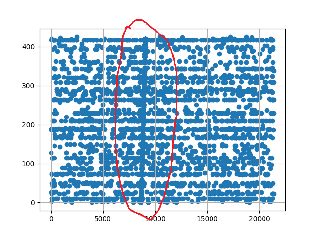
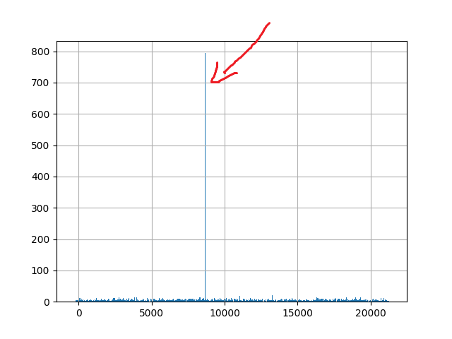

Текущая версия распознавания использования чужого контента базируется на идентификации аудио фрагментов.

## Индексация
* Аудиодорожка подвергается просмотру окном size=1024 и шагом 32.
* В каждом окне выполняется быстрое преобразование Фурье и сигнал раскладывается по частотам
* Частоты наносятся на логарифмическую шкалу
* получившаяся спектрограмма визуализируется при помощи matplotlib в 2D массив
* на спектрограмме находятся локальные максимумы в каждом квадрате определенного размера
* далее оставляем только найденные точки и отбрасываем все остальное
* строим связи между каждой точкой и N=10 последующих точек. Для каждой пары запоминаем относительное расположение.
* Хешируем информацию о связи и сохраняем хеш и смещение в базу данных

## Поиск
* При поиске также получаем последовательность хешей для проверяемого файла
* Находим в базе записи с такими же хешами
* Для каждого найденного хеша кладем в корзину - mediaId, stored_offset-sampled_offset, прочую информацию. Если отрисовать график, в случае совпадения можно увидеть линию y = x + b:
* смотрим, сколько элементов в каждой корзине. Если есть корзина со значительным количеством элементов, значит совпадение найдено: 
* Далее отбрасываются outlayers и определяются границы сегмента.